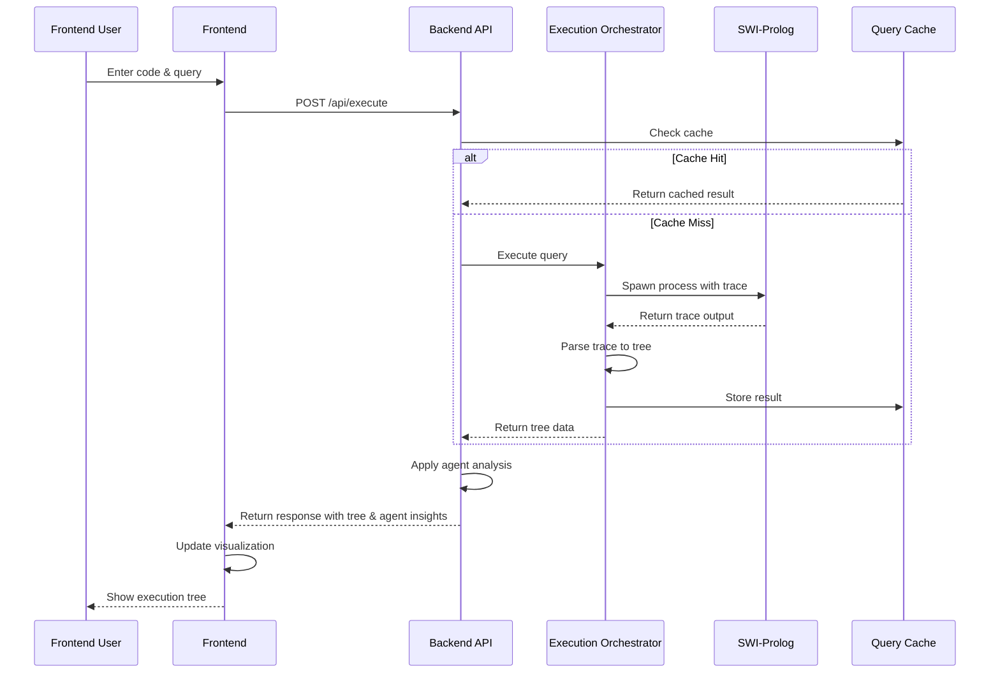

# System Architecture

## Overview
Prolog Tutor is a web-based educational tool that visualizes Prolog execution. The system integrates a modern web frontend with a SWI-Prolog backend through a Node.js orchestration layer.

## High-Level Architecture

```
┌─────────────────────────────────────────────────────────────────────────┐
│                              User Interface                             │
├─────────────────────────────────────────────────────────────────────────┤
│  ┌─────────────┐  ┌─────────────┐  ┌─────────────┐  ┌─────────────┐   │
│  │   Code      │  │  Tree       │  │  Agent      │  │  Knowledge  │   │
│  │   Editor    │  │  Visualization│  │  Panel     │  │  Base      │   │
│  │             │  │             │  │             │  │  Manager    │   │
│  └─────────────┘  └─────────────┘  └─────────────┘  └─────────────┘   │
└─────────────────────────────────────────────────────────────────────────┘
                                    │
                                    ▼
┌─────────────────────────────────────────────────────────────────────────┐
│                          Frontend (React)                               │
│  ┌──────────────────────────────────────────────────────────────────┐  │
│  │  State Management: Zustand                                      │  │
│  │  • Code state                                                   │  │
│  │  • Execution state                                              │  │
│  │  • UI state                                                     │  │
│  │  • Agent state                                                  │  │
│  └──────────────────────────────────────────────────────────────────┘  │
└─────────────────────────────────────────────────────────────────────────┘
                                    │
                                    ▼
┌─────────────────────────────────────────────────────────────────────────┐
│                          Backend API Gateway                            │
│  ┌──────────────────────────────────────────────────────────────────┐  │
│  │  Express.js Server                                              │  │
│  │  • REST API endpoints                                           │  │
│  │  • Request validation                                           │  │
│  │  • Authentication & authorization                               │  │
│  │  • Rate limiting                                                │  │
│  └──────────────────────────────────────────────────────────────────┘  │
└─────────────────────────────────────────────────────────────────────────┘
                                    │
                                    ▼
┌─────────────────────────────────────────────────────────────────────────┐
│                     Execution Orchestration Layer                       │
├─────────────────────────────────────────────────────────────────────────┤
│  ┌─────────────┐  ┌─────────────┐  ┌─────────────┐  ┌─────────────┐   │
│  │  File       │  │  Process    │  │  Query      │  │  Agent      │   │
│  │  Manager    │  │  Pool       │  │  Cache      │  │  Service    │   │
│  └─────────────┘  └─────────────┘  └─────────────┘  └─────────────┘   │
└─────────────────────────────────────────────────────────────────────────┘
                                    │
                                    ▼
┌─────────────────────────────────────────────────────────────────────────┐
│                          SWI-Prolog Engine                              │
│  ┌──────────────────────────────────────────────────────────────────┐  │
│  │  Prolog Process                                                 │  │
│  │  • Load knowledge base                                          │  │
│  │  • Execute query with trace                                     │  │
│  │  • Generate execution trace                                     │  │
│  └──────────────────────────────────────────────────────────────────┘  │
└─────────────────────────────────────────────────────────────────────────┘
```

## Component Details

### 1. Frontend Architecture

#### 1.1 Component Hierarchy
```
App
├── Layout
│   ├── Header
│   ├── SplitPaneLayout
│   │   ├── CodeEditorPane
│   │   │   ├── CodeEditor
│   │   │   ├── Toolbar
│   │   │   └── FileTabs
│   │   ├── VisualizationPane
│   │   │   ├── TreeVisualization
│   │   │   ├── ExecutionControls
│   │   │   └── AgentAnnotations
│   │   └── SidePanel
│   │       ├── AgentPanel
│   │       ├── KnowledgeBaseBrowser
│   │       └── Console
│   └── Footer
└── Modals
    ├── Settings
    ├── Tutorial
    └── Export
```

#### 1.2 State Management
```javascript
// Global store structure
const store = {
  // Code management
  code: {
    content: string,
    files: Map<string, string>,
    currentFile: string,
    unsavedChanges: boolean
  },
  
  // Execution
  execution: {
    treeData: TreeData | null,
    isExecuting: boolean,
    currentStep: number,
    totalSteps: number,
    speed: number, // 0.5x to 5x
    breakpoints: Set<number>
  },
  
  // Knowledge bases
  knowledgeBases: {
    local: Map<string, KnowledgeBase>,
    saved: Map<string, KnowledgeBase>,
    current: string | null
  },
  
  // Agents
  agents: {
    configurations: Map<string, AgentConfig>,
    responses: AgentResponse[],
    enabled: Set<string>
  },
  
  // UI
  ui: {
    theme: 'light' | 'dark',
    layout: LayoutConfig,
    panelStates: Map<string, boolean>,
    tutorialStep: number
  }
};
```

### 2. Backend Architecture

#### 2.1 API Layer
```
Backend/
├── app.js                    # Main Express application
├── routes/
│   ├── api.js               # API router
│   ├── execution.js         # Query execution endpoints
│   ├── knowledgeBase.js     # KB management endpoints
│   ├── agents.js           # Agent service endpoints
│   └── system.js           # Health, metrics, admin
├── controllers/
│   ├── executionController.js
│   ├── knowledgeBaseController.js
│   └── agentController.js
├── services/
│   ├── prologService.js     # SWI-Prolog integration
│   ├── fileService.js      # Temporary file management
│   ├── cacheService.js     # Query caching
│   └── agentService.js     # Agent rule engine
├── middleware/
│   ├── validation.js       # Input validation
│   ├── timeout.js         # Request timeout handling
│   ├── rateLimit.js       # Rate limiting
│   └── errorHandler.js    # Error handling
└── utils/
    ├── prologParser.js    # Trace parsing
    ├── treeBuilder.js     # Tree construction
    └── logger.js         # Structured logging
```

#### 2.2 Execution Flow


### 3. Data Flow

#### 3.1 Query Execution Pipeline
```
1. User Input
   ↓
2. Frontend Validation
   ↓
3. API Request (JSON)
   ↓
4. Backend Validation & Sanitization
   ↓
5. Cache Lookup
   ↓
6. File Creation (temp .pl file)
   ↓
7. Process Acquisition (from pool)
   ↓
8. SWI-Prolog Execution with Trace
   ↓
9. Trace Parsing & Tree Construction
   ↓
10. Agent Analysis
    ↓
11. Cache Storage
    ↓
12. API Response
    ↓
13. Frontend Rendering
```

#### 3.2 Tree Data Structure
```typescript
interface TreeNode {
  id: string;
  goal: string;
  status: 'pending' | 'success' | 'fail';
  level: number;
  bindings: Map<string, string>;
  children: TreeNode[];
  metadata: {
    executionTime: number;
    ruleUsed: string | null;
    port: 'call' | 'exit' | 'fail' | 'redo';
    step: number;
  };
}

interface TreeData {
  root: TreeNode;
  metadata: {
    totalSteps: number;
    executionTime: number;
    success: boolean;
    solutions: number;
    maxDepth: number;
  };
}
```

### 4. Integration Points

#### 4.1 SWI-Prolog Integration
```javascript
// Process management
class PrologProcess {
  constructor() {
    this.process = spawn('swipl', ['-q', '--no-tty']);
    this.busy = false;
    this.lastUsed = Date.now();
  }
  
  async execute(commands) {
    return new Promise((resolve, reject) => {
      let output = '';
      let error = '';
      
      this.process.stdout.on('data', (data) => output += data);
      this.process.stderr.on('data', (data) => error += data);
      
      this.process.on('close', (code) => {
        if (code === 0) {
          resolve({ output, error });
        } else {
          reject(new Error(`Prolog exited with code ${code}: ${error}`));
        }
      });
      
      this.process.stdin.write(commands.join('\n'));
      this.process.stdin.end();
    });
  }
}
```

#### 4.2 Agent Service Integration
```javascript
// Agent service orchestration
class AgentOrchestrator {
  constructor(ruleEngine, context) {
    this.ruleEngine = ruleEngine;
    this.context = context;
  }
  
  async analyze(executionData) {
    const context = {
      ...this.context,
      ...executionData,
      timestamp: Date.now()
    };
    
    const results = {};
    
    // Parallel agent analysis
    await Promise.all([
      this.analyzeExplanation(context).then(r => results.explanation = r),
      this.analyzeHints(context).then(r => results.hints = r),
      this.analyzeDebugging(context).then(r => results.debugging = r)
    ]);
    
    return results;
  }
}
```

### 5. Deployment Architecture

#### 5.1 Development Environment
```
┌─────────────┐    ┌─────────────┐    ┌─────────────┐
│   React     │    │   Node.js   │    │  SWI-Prolog │
│   Dev Server│◄──►│   Express   │◄──►│   Process   │
│   (Vite)    │    │   Server    │    │             │
└─────────────┘    └─────────────┘    └─────────────┘
       │                   │                   │
       ▼                   ▼                   ▼
┌─────────────┐    ┌─────────────┐    ┌─────────────┐
│   Browser   │    │   File      │    │   System    │
│             │    │   System    │    │   Temp      │
└─────────────┘    └─────────────┘    └─────────────┘
```

#### 5.2 Production Environment
```
┌─────────────────────────────────────────────────────────┐
│                    Load Balancer                        │
│                    (NGINX / HAProxy)                    │
└─────────────────────────────────────────────────────────┘
                         │
         ┌───────────────┼───────────────┐
         ▼               ▼               ▼
┌─────────────┐ ┌─────────────┐ ┌─────────────┐
│   Frontend  │ │   Backend   │ │   Backend   │
│   Server    │ │   Server 1  │ │   Server 2  │
│   (Static)  │ │             │ │             │
└─────────────┘ └─────────────┘ └─────────────┘
                         │               │
                         └───────┬───────┘
                                 ▼
                    ┌─────────────────────┐
                    │   Shared Cache      │
                    │   (Redis)           │
                    └─────────────────────┘
                                 │
                    ┌─────────────────────┐
                    │   Database          │
                    │   (PostgreSQL)      │
                    │   • Knowledge bases │
                    │   • User data       │
                    │   • Analytics       │
                    └─────────────────────┘
```

### 6. Security Architecture

#### 6.1 Defense Layers
```
1. Input Validation
   • Prolog syntax validation
   • Size limits
   • Malicious pattern detection

2. Process Isolation
   • SWI-Prolog in sandbox
   • Resource limits (CPU, memory)
   • Timeout enforcement

3. API Security
   • Rate limiting
   • Request validation
   • CORS configuration

4. Data Security
   • Temporary file cleanup
   • No sensitive data in logs
   • Secure file permissions
```

#### 6.2 Sandbox Configuration
```javascript
const sandboxConfig = {
  // Resource limits
  timeout: 5000, // 5 seconds
  memoryLimit: '100MB',
  
  // File system restrictions
  readOnly: true,
  allowedPaths: ['/tmp/prolog-tutor'],
  
  // Process restrictions
  noNetwork: true,
  noSubprocess: true,
  
  // SWI-Prolog specific
  safeMode: true,
  disableBuiltins: ['shell', 'exec', 'system']
};
```

### 7. Monitoring & Observability

#### 7.1 Key Metrics
```prometheus
# Response time metrics
prolog_tutor_request_duration_seconds{endpoint="/api/execute"}
prolog_tutor_request_duration_seconds{endpoint="/api/knowledge-bases"}

# Cache metrics
prolog_tutor_cache_hits_total
prolog_tutor_cache_misses_total
prolog_tutor_cache_size_bytes

# Process pool metrics
prolog_tutor_process_pool_size
prolog_tutor_process_pool_available
prolog_tutor_process_pool_busy

# Error metrics
prolog_tutor_errors_total{type="validation"}
prolog_tutor_errors_total{type="execution"}
prolog_tutor_errors_total{type="timeout"}
```

#### 7.2 Health Checks
```javascript
// Health check endpoints
app.get('/health', (req, res) => {
  const health = {
    status: 'healthy',
    timestamp: new Date().toISOString(),
    components: {
      api: checkApiHealth(),
      prolog: checkPrologHealth(),
      cache: checkCacheHealth(),
      database: checkDatabaseHealth()
    }
  };
  
  res.json(health);
});
```

### 8. Scalability Considerations

#### 8.1 Horizontal Scaling
- Stateless backend servers
- Shared Redis cache
- Database connection pooling
- Load balancer with sticky sessions

#### 8.2 Vertical Scaling
- Process pool size adjustment
- Cache size optimization
- Memory allocation tuning
- Connection limit configuration

#### 8.3 Performance Targets
- 95% of requests <200ms
- Support 100 concurrent users
- Process pool utilization <80%
- Cache hit rate >30%

## Conclusion

This architecture provides a scalable, maintainable foundation for the Prolog Tutor system. The separation of concerns between frontend visualization, backend orchestration, and SWI-Prolog execution allows for independent development and optimization of each component.

Key architectural decisions:
1. **Process pooling** for SWI-Prolog to reduce startup overhead
2. **Query caching** to improve response times for repeated queries
3. **Rule-based agents** for extensible educational assistance
4. **Sandboxed execution** for security
5. **Modular design** for easy maintenance and testing